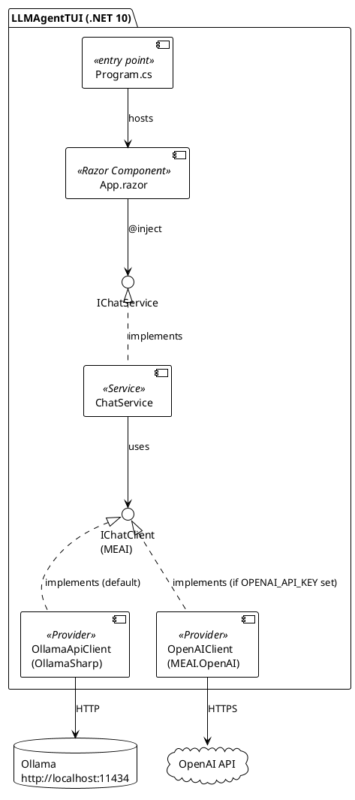
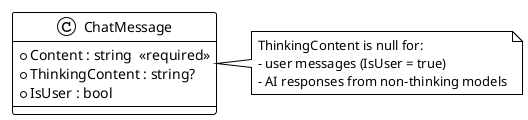
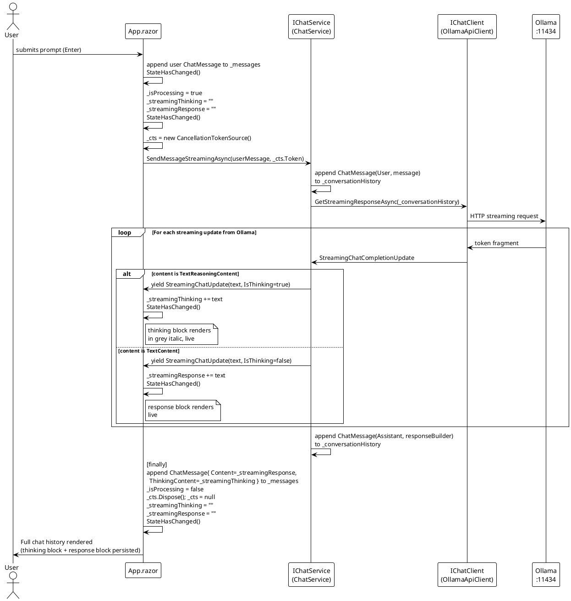

# Show AI Model Thinking — Implementation Documentation

---

## Workflow State

| Field | Value |
|---|---|
| Current Phase | DOCUMENTATION GENERATION PHASE |
| Phase Status | COMPLETE |
| Last Updated | 2026-03-12 |

### Phase History

| Phase | Started | Completed |
|---|---|---|
| DOCUMENTATION PLANNING PHASE | 2026-03-12 | 2026-03-12 |
| DOCUMENTATION GENERATION PHASE | 2026-03-12 | 2026-03-12 |

---

## Summary

- **Critical:** `OllamaSharp` (v5.4.23) must be used instead of `Microsoft.Extensions.AI.Ollama` — the MEAI package was removed from NuGet entirely. Thinking tokens surface as `TextReasoningContent` in `update.Contents`, not as `<think>` tags in raw text.
- **Critical:** RazorConsole's `<Padder>` requires a fixed child count — no `@if` or `foreach` directly inside `<Padder>`. All conditional rendering must live at `<Rows>` level.
- **Critical:** RazorConsole re-renders only when items are **appended** to a list, not when existing items are mutated. Live streaming content must accumulate in component-level fields, not in a pre-added placeholder.
- `IChatService` was redesigned from a blocking `Task<string>` to a streaming `IAsyncEnumerable<StreamingChatUpdate>` — the single architectural seam through which both thinking tokens and response tokens flow to the UI.
- Thinking content is stored in the UI model (`ChatMessage.ThinkingContent`) but excluded from the service-layer conversation history sent back to the model.
- The `<Markdown>` component has no `Foreground` parameter — applying colour to bot responses requires `<Markup>`, which trades Markdown rendering for colour support.

---

## 1. Overview

### Purpose

This feature extends the `LLMAgentTUI` terminal chat application to surface the **thinking (reasoning) stream** produced by thinking-capable AI models — such as `qwen3.5:9b` running on Ollama — in real time. Prior to this feature, the application used a single blocking API call and discarded thinking tokens silently. Users experienced a silent wait with no feedback during the model's reasoning phase.

### What Changed

| Capability | Before | After |
|---|---|---|
| Thinking stream visible | No — silently discarded | Yes — streamed in real time, displayed in grey italic |
| Response delivery | Blocking `CompleteAsync` — full response returned at once | Streaming via `GetStreamingResponseAsync` — token-by-token |
| Response colour (history) | Default terminal colour | Light blue (`Color.LightSkyBlue1`) |
| Thinking persistence | N/A | Always retained and displayed above each bot response |
| Ollama integration | `Microsoft.Extensions.AI.Ollama` v9.x (deprecated, removed) | `OllamaSharp` v5.4.23 + MEAI 10.3.0 |

### Scope

**In scope:**
- Streaming and rendering thinking/reasoning output from thinking-capable models in real time
- Rendering the final response after thinking output completes
- Visual separation: thinking output (grey, italic) vs. final response (light blue)
- Graceful handling of non-thinking models — no thinking block rendered when no thinking tokens are received

**Out of scope:**
- Changes to prompt entry
- Model selection or configuration
- Persisting or exporting thinking output beyond the session
- Backend or API changes beyond what is required to consume the thinking stream

---

## 2. Architecture

### Application Stack

`LLMAgentTUI` is a single-project, single-layer .NET 10 console application. There are no domain layers, microservices, or data layers — the architecture is flat and direct.

**PlantUML:**



**ASCII Art:**

```
┌──────────────────────────────────────────────────────────┐
│  LLMAgentTUI (.NET 10)                                   │
│                                                          │
│  ┌─────────────┐                                         │
│  │ Program.cs  │──────hosts──────────────────────┐       │
│  └─────────────┘                                 │       │
│                                                  ▼       │
│  ┌───────────────────────────────────────────────────┐   │
│  │  App.razor (Razor Component)                      │   │
│  └───────────────────────┬───────────────────────────┘   │
│                          │ @inject                        │
│                          ▼                                │
│              ┌──────────────────────┐                     │
│              │   «interface»        │                     │
│              │   IChatService       │                     │
│              └──────────┬───────────┘                     │
│                         │ implements                      │
│              ┌──────────▼───────────┐                     │
│              │   ChatService        │                     │
│              └──────────┬───────────┘                     │
│                         │ uses                            │
│              ┌──────────▼───────────┐                     │
│              │  «interface»         │                     │
│              │  IChatClient (MEAI)  │                     │
│              └──────┬──────┬────────┘                     │
│                     │      │                              │
│            ┌────────▼──┐ ┌─▼────────────────┐            │
│            │OllamaApi  │ │ OpenAIClient      │            │
│            │Client     │ │ (if OPENAI_API_KEY│            │
│            │(default)  │ │  set)             │            │
│            └────────┬──┘ └─┬────────────────┘            │
└─────────────────────┼──────┼───────────────────────────┘
                      │      │
              ┌───────▼──┐ ┌─▼──────────┐
              │  Ollama  │ │ OpenAI API │
              │ :11434   │ │            │
              └──────────┘ └────────────┘
```

### Provider Selection

Provider selection is resolved at startup in `Program.cs`:

```csharp
var useOllama = string.IsNullOrEmpty(Environment.GetEnvironmentVariable("OPENAI_API_KEY"));
```

| Condition | Provider | Model |
|---|---|---|
| `OPENAI_API_KEY` not set (default) | `OllamaApiClient` (`OllamaSharp`) | `qwen3.5:9b` at `http://localhost:11434` |
| `OPENAI_API_KEY` set | `OpenAIClient` (`MEAI.OpenAI`) | `gpt-4o-mini` |

> The thinking stream feature is only active when using a thinking-capable model (e.g. `qwen3.5:9b`). When using a non-thinking model, no `TextReasoningContent` events are produced, `ThinkingContent` remains `null`, and the thinking block is not rendered.

---

## 3. Service Contract — `IChatService`

### Business Capability

`IChatService` is the sole service boundary in the application. It abstracts AI model communication from the UI component (`App.razor`). The contract exposes a single streaming operation that delivers both thinking tokens and final response tokens as a unified, discriminated async stream.

**File:** `src/LLMAgentTUI./Services/IChatService.cs`

```csharp
public interface IChatService
{
    IAsyncEnumerable<StreamingChatUpdate> SendMessageStreamingAsync(
        string message,
        CancellationToken cancellationToken = default);
}
```

**PlantUML:**

```plantuml
@startuml
!theme plain

interface IChatService {
  + SendMessageStreamingAsync(message: string, cancellationToken: CancellationToken) : IAsyncEnumerable<StreamingChatUpdate>
}

class ChatService implements IChatService {
  - _chatClient : IChatClient
  - _conversationHistory : List<ChatMessage>
  + SendMessageStreamingAsync(message: string, cancellationToken: CancellationToken) : IAsyncEnumerable<StreamingChatUpdate>
}

class "App.razor" as App
App --> IChatService : "@inject"

record StreamingChatUpdate {
  + Text : string
  + IsThinking : bool
}

IChatService ..> StreamingChatUpdate : yields

@enduml
```

**ASCII Art:**

```
┌──────────────────────────────────────────────────────┐
│  «interface»  IChatService                           │
│ ──────────────────────────────────────────────────── │
│  + SendMessageStreamingAsync(                        │
│      message: string,                                │
│      cancellationToken: CancellationToken            │
│    ) : IAsyncEnumerable<StreamingChatUpdate>         │
└──────────────────────────┬───────────────────────────┘
                           │ implements
            ┌──────────────▼───────────────────┐
            │  ChatService                      │
            │  - _chatClient: IChatClient       │
            │  - _conversationHistory: List<..> │
            └───────────────────────────────────┘

   App.razor ──@inject──▶ IChatService
                                │
                                │ yields
                                ▼
                    ┌───────────────────────┐
                    │  «record»             │
                    │  StreamingChatUpdate  │
                    │  Text      : string   │
                    │  IsThinking: bool     │
                    └───────────────────────┘
```

### Contract Operation — `SendMessageStreamingAsync`

**Signature:**

```csharp
IAsyncEnumerable<StreamingChatUpdate> SendMessageStreamingAsync(
    string message,
    CancellationToken cancellationToken = default);
```

**Purpose:** Appends the user message to conversation history, streams the AI model response, and yields discriminated token fragments tagged as either thinking (`IsThinking = true`) or response (`IsThinking = false`).

**Preconditions:**
- `message` must not be null or empty
- The underlying `IChatClient` must be reachable (Ollama running locally, or OpenAI API key valid)

**Postconditions:**
- The user message is appended to `_conversationHistory` as `ChatRole.User` before streaming begins
- The final assembled response (response tokens only) is appended to `_conversationHistory` as `ChatRole.Assistant` after streaming completes
- Thinking content is **not** stored in `_conversationHistory` — only the final response is

**Behavioral Guarantees:**
- **Streaming:** Yields token fragments incrementally as the model generates them — no full-response buffering
- **Discrimination:** Each yielded `StreamingChatUpdate` is tagged unambiguously: `IsThinking = true` for reasoning tokens, `IsThinking = false` for response tokens
- **Graceful non-thinking models:** If the model produces no `TextReasoningContent`, only `IsThinking = false` updates are yielded — the consumer handles this transparently
- **Cancellable:** Respects the provided `CancellationToken` via `[EnumeratorCancellation]` — streaming terminates cleanly on cancellation
- **History integrity:** The `_conversationHistory` append uses whatever response was accumulated in `responseBuilder` at loop exit — even if streaming is cancelled mid-response

**Exceptions:**
- `HttpRequestException` or provider-level exceptions propagate to the caller (`App.razor`'s `catch` block)
- `OperationCanceledException` propagates on cancellation

### Contract Versioning

This interface replaced the previous synchronous contract as part of this feature. The old contract is fully removed — no backward compatibility layer.

| Version | Method | Notes |
|---|---|---|
| v1 (pre-feature) | `Task<string> SendMessageAsync(string)` | Blocking; returns fully assembled response string |
| v2 (this feature) | `IAsyncEnumerable<StreamingChatUpdate> SendMessageStreamingAsync(string, CancellationToken)` | Streaming; discriminated thinking/response tokens |

---

## 4. Component API — `StreamingChatUpdate`

### Purpose

`StreamingChatUpdate` is the discriminated token fragment type yielded by `IChatService.SendMessageStreamingAsync`. It is the boundary type between the service layer and the UI layer. A single record carries both thinking and response tokens — the `IsThinking` flag routes each fragment to the correct buffer in the consumer.

**File:** `src/LLMAgentTUI./Services/StreamingChatUpdate.cs`

```csharp
public record StreamingChatUpdate(string Text, bool IsThinking);
```

### Properties

| Property | Type | Description |
|---|---|---|
| `Text` | `string` | The token fragment text yielded by the model for this update |
| `IsThinking` | `bool` | `true` = reasoning/thinking fragment; `false` = final response fragment |

### Usage

```csharp
await foreach (var update in ChatService.SendMessageStreamingAsync(userMessage, _cts.Token))
{
    if (update.IsThinking)
        _streamingThinking += update.Text;   // → grey italic thinking block
    else
        _streamingResponse += update.Text;   // → response block

    StateHasChanged();
}
```

### Design Rationale

Strategy A (`IAsyncEnumerable<StreamingChatUpdate>`) was selected over three alternatives evaluated during analysis:

| Strategy | Verdict | Reason |
|---|---|---|
| A: `IAsyncEnumerable<StreamingChatUpdate>` | ✅ Selected | Idiomatic .NET async streaming; `await foreach` in consumer; cancellable; clean contract |
| B: Callback delegates `(Action<string> onThinking, Action<string> onResponse)` | ❌ | Bleeds UI concerns into service contract; harder to cancel |
| C: `Task<(string Thinking, string Response)>` | ❌ | Batch result — violates real-time thinking progress requirement |
| D: Struct with two separate `IAsyncEnumerable`s | ❌ | No framework support for coordinated dual enumeration; overengineered |

### `TextReasoningContent` vs. `<think>` Tag Parsing

The implementation plan called for a `<think>` tag state machine. A deviation during implementation replaced it entirely:

| Aspect | Planned: tag parsing | Actual: `TextReasoningContent` |
|---|---|---|
| Approach | State machine scanning for `<think>` / `</think>` in raw text | Pattern match `content is TextReasoningContent` in `update.Contents` |
| Complexity | High — must handle partial tag boundaries mid-fragment | Low — provider handles discrimination natively |
| Robustness | Fragile — depends on tag format staying constant | Robust — relies on provider's native type system |
| Code | ~30 lines of state machine logic | 2 lines of pattern matching |

The key implementation detail in `ChatService`:

```csharp
foreach (var content in update.Contents)
{
    if (content is TextReasoningContent reasoningContent && !string.IsNullOrEmpty(reasoningContent.Text))
    {
        thinkingBuilder.Append(reasoningContent.Text);
        yield return new StreamingChatUpdate(reasoningContent.Text, true);
    }
    else if (content is TextContent textContent && !string.IsNullOrEmpty(textContent.Text))
    {
        responseBuilder.Append(textContent.Text);
        yield return new StreamingChatUpdate(textContent.Text, false);
    }
}
```

> **Important:** `update.Text` only aggregates `TextContent`, not `TextReasoningContent`. Always iterate `update.Contents` and pattern-match explicitly — using `update.Text` alone silently drops all thinking tokens.

---

## 5. Data Model — `ChatMessage`

`ChatMessage` is an inner class defined in `App.razor`'s `@code` block. It is the UI-layer representation of a conversation turn — distinct from `Microsoft.Extensions.AI.ChatMessage` used at the service layer.

**File:** `src/LLMAgentTUI./Components/App.razor` (inner class)

```csharp
public class ChatMessage
{
    public required string Content { get; set; }
    public string? ThinkingContent { get; set; }
    public bool IsUser { get; set; }
}
```

**PlantUML:**



**ASCII Art:**

```
┌──────────────────────────────────────────┐
│  ChatMessage (inner class, App.razor)    │
│ ──────────────────────────────────────── │
│  + Content        : string  [required]   │
│  + ThinkingContent: string? [nullable]   │
│  + IsUser         : bool                 │
└──────────────────────────────────────────┘

ThinkingContent is null when:
  • IsUser = true  (user messages have no thinking)
  • AI response from a non-thinking model
```

### Properties

| Property | Type | Nullable | Description |
|---|---|---|---|
| `Content` | `string` | No (`required`) | The final response text from the AI, or the user's message text |
| `ThinkingContent` | `string?` | Yes | Accumulated thinking/reasoning text. `null` for user messages and non-thinking AI responses |
| `IsUser` | `bool` | — | `true` = user message; `false` = AI (bot) message |

### Before / After

This feature added `ThinkingContent` to the existing model:

```csharp
// Before
public class ChatMessage
{
    public required string Content { get; set; }
    public bool IsUser { get; set; }
}

// After
public class ChatMessage
{
    public required string Content { get; set; }
    public string? ThinkingContent { get; set; }   // ← added
    public bool IsUser { get; set; }
}
```

### Dual Conversation Representation

The application maintains two parallel conversation representations:

| | Type | Owner | Content | Purpose |
|---|---|---|---|---|
| UI model | `List<ChatMessage>` | `App.razor` | `Content` + `ThinkingContent` | Rendering the chat history in the TUI |
| Service history | `List<Microsoft.Extensions.AI.ChatMessage>` | `ChatService` | Response only (no thinking) | Sending conversation context to the AI model |

Thinking content is stored in the UI model for display but excluded from the service-layer history — thinking tokens are not re-sent to the model as prior context.

---

## 6. Streaming Flow

End-to-end sequence from user prompt submission through to final rendered state.

**PlantUML:**



**ASCII Art:**

```
User          App.razor          ChatService        OllamaApiClient       Ollama
 │                │                   │                   │                  │
 │──submit──────▶│                   │                   │                  │
 │               │ append user msg   │                   │                  │
 │               │ _isProcessing=true│                   │                  │
 │               │ StateHasChanged() │                   │                  │
 │               │                   │                   │                  │
 │               │──SendMessageStreamingAsync(msg,token)▶│                  │
 │               │                   │──GetStreaming────▶│                  │
 │               │                   │                   │──HTTP stream────▶│
 │               │                   │                   │                  │
 │    ┌──────────────────────── streaming loop ──────────────────────────┐  │
 │    │          │                   │◀──StreamingUpdate─────────────────│  │
 │    │          │         TextReasoningContent?                         │  │
 │    │          │◀──yield(text, IsThinking=true)────────────────────────│  │
 │    │          │ _streamingThinking+=text                              │  │
 │    │          │ StateHasChanged() ← grey italic block renders live    │  │
 │    │          │                   │                                   │  │
 │    │          │         TextContent?                                  │  │
 │    │          │◀──yield(text, IsThinking=false)───────────────────────│  │
 │    │          │ _streamingResponse+=text                              │  │
 │    │          │ StateHasChanged() ← response block renders live       │  │
 │    └──────────────────────────────────────────────────────────────────┘  │
 │               │                   │                   │                  │
 │               │  [finally]        │                   │                  │
 │               │  append ChatMessage{Content, ThinkingContent}            │
 │               │  _isProcessing=false                                     │
 │               │  StateHasChanged()                                       │
 │               │                   │                   │                  │
 │◀─ full render─│                   │                   │                  │
```

---

## 7. Rendering Logic

### Component State Fields

`App.razor` introduces three new fields to manage in-progress streaming:

```csharp
private CancellationTokenSource? _cts;
private string _streamingThinking = string.Empty;
private string _streamingResponse = string.Empty;
```

These accumulate streaming content during an in-progress request. They are cleared in the `finally` block after the final `ChatMessage` is appended to `_messages`.

Full component state:

| Field | Type | Purpose |
|---|---|---|
| `_messages` | `List<ChatMessage>` | Completed conversation history rendered in the loop |
| `_currentInput` | `string` | Bound to `<TextInput>` — cleared on send |
| `_isProcessing` | `bool` | Guards live streaming blocks and spinner visibility |
| `_cts` | `CancellationTokenSource?` | Cancellation handle for the active streaming operation |
| `_streamingThinking` | `string` | Accumulates thinking tokens during in-progress streaming |
| `_streamingResponse` | `string` | Accumulates response tokens during in-progress streaming |

### Completed Message Rendering (History Loop)

```razor
foreach (var message in _messages)
{
    @if (message.IsUser)
    {
        <Padder Padding="@(new(0, 1, 0, 0))">
            <Markup Content="You" Foreground="@Color.Green" />
            <Markup Content=" " />
            <Markdown Content="@message.Content" />
        </Padder>
    }
    else
    {
        @if (!string.IsNullOrEmpty(message.ThinkingContent))
        {
            <Padder Padding="@(new(0, 1, 0, 0))">
                <Markup Content="@message.ThinkingContent" Foreground="@Color.Grey" Decoration="@Decoration.Italic" />
            </Padder>
        }
        <Padder Padding="@(new(0, 1, 0, 0))">
            <Markup Content="Bot" Foreground="@Color.Blue" />
            <Markup Content=" " />
            <Markup Content="@($"{message.Content}")" foreground="@Color.LightSkyBlue1" />
        </Padder>
    }
}
```

### Live Streaming Blocks (In-Progress State)

```razor
@if (_isProcessing && !string.IsNullOrEmpty(_streamingThinking))
{
    <Padder Padding="@(new(0, 1, 0, 0))">
        <Markup Content="@_streamingThinking" Foreground="@Color.Grey" Decoration="@Decoration.Italic" />
    </Padder>
}

@if (_isProcessing && !string.IsNullOrEmpty(_streamingResponse))
{
    <Padder Padding="@(new(0, 1, 0, 0))">
        <Markup Content="Bot" Foreground="@Color.Blue" />
        <Markup Content=" " />
        <Markup Content="@($"{_streamingResponse}")" Foreground="@Color.Red" />
    </Padder>
}

@if (_isProcessing)
{
    <Padder Padding="@(new(0, 1, 1, 0))">
        <Columns>
            <RazorConsole.Components.Spinner SpinnerType="@Spectre.Console.Spinner.Known.Dots" />
            <Markup Content="AI is thinking..." Foreground="@Color.Grey" Decoration="@Decoration.Italic" />
        </Columns>
    </Padder>
}
```

> **Note:** The live streaming response block uses `Color.Red` during streaming. Once streaming completes, the persisted message in the history loop renders in `Color.LightSkyBlue1`. This is the current behaviour as implemented.

### RazorConsole Constraints

Two RazorConsole-specific constraints discovered during implementation shape this architecture:

**Constraint 1 — `<Padder>` requires a fixed child count**

Placing `@if` blocks or `foreach` loops directly inside `<Padder>` causes all children to fail to render. All conditional content must be placed at the `<Rows>` level — each `<Padder>` must always receive the same fixed set of children.

*Consequence:* Each conditional block (thinking / response) is its own separate `<Padder>` at `<Rows>` scope, rather than nested inside a shared outer `<Padder>`.

**Constraint 2 — Re-render triggers on list append only, not item mutation**

Mutating a `_messages[index]` item's properties during streaming does not trigger a re-render. Only appending a new item to `_messages` causes re-render.

*Consequence:* Streaming content accumulates in `_streamingThinking` / `_streamingResponse` (re-read on every `StateHasChanged()` call). The final `ChatMessage` is appended to `_messages` only once, after streaming completes — consistent with the pre-existing append-only pattern in the codebase.

---

## 8. Dependencies

### Package Changes

| Package | Before | After | Reason |
|---|---|---|---|
| `Microsoft.Extensions.AI` | `9.1.0-preview.1.25064.3` | `10.3.0` | API rename: `CompleteStreamingAsync` → `GetStreamingResponseAsync` |
| `Microsoft.Extensions.AI.Ollama` | `9.1.0-preview.1.25064.3` | **Removed** | Package deprecated and removed from NuGet entirely |
| `Microsoft.Extensions.AI.OpenAI` | `9.1.0-preview.1.25064.3` | `10.3.0` | Extension API change: `AsChatClient()` → `AsIChatClient()` on `ChatClient` |
| `OllamaSharp` | — | `5.4.23` | Replacement for `Microsoft.Extensions.AI.Ollama`; correctly surfaces thinking via `TextReasoningContent` |
| `Microsoft.Extensions.Hosting` | `8.0.0` | `8.0.0` | Unchanged |
| `RazorConsole.Core` | `0.3.0` | `0.3.0` | Unchanged |
| `Spectre.Console` | `0.54.0` | `0.54.0` | Unchanged |

### Why OllamaSharp?

The original implementation plan called for `Microsoft.Extensions.AI.Ollama` with a `<think>` tag state machine. ILSpy decompilation during analysis confirmed that `OllamaChatClient` in v9.x surfaced all content — including thinking — as `TextContent`, with `<think>` and `</think>` tags as literal text characters.

When implementation began, the package had been removed from NuGet entirely. The root cause: newer Ollama (0.6.5+) changed its API to send thinking content in a dedicated `thinking` field rather than inline in `content`. MEAI v9.x's `OllamaChatClient` did not map this field and silently discarded thinking content.

`OllamaSharp` v5.4.23 is the current community-standard Ollama integration for MEAI. It correctly maps the Ollama `thinking` field to `TextReasoningContent` in MEAI's `update.Contents`, eliminating the need for the tag-parsing state machine entirely.

---

## 9. Implementation Decisions

Four deviations from the approved Implementation Plan were required. All four were approved by the Architect.

### Deviation 1 — RazorConsole `<Padder>` Child Count Constraint

| Field | Detail |
|---|---|
| **Planned** | Conditional `@if (!string.IsNullOrEmpty(message.ThinkingContent))` block placed inside a single outer `<Padder>` for the thinking block |
| **Actual** | `<Padder>` does not support dynamic child counts — placing `@if` inside `<Padder>` caused all children to fail to render |
| **Reason** | The original codebase convention: `<Rows>` handles dynamic/conditional children; `<Padder>` always receives a fixed set. The plan did not account for this constraint. |
| **Impact** | Rendering loop restructured: two separate `<Padder>` instances for bot messages — one conditional (thinking), one unconditional (response) — both at `<Rows>` level |
| **Decision** | APPROVED — self-evident fix from existing codebase convention |

### Deviation 2 — RazorConsole Append-Only Re-render Model

| Field | Detail |
|---|---|
| **Planned** | Pre-add an empty `ChatMessage` to `_messages` before streaming begins, capture its index, and mutate `Content`/`ThinkingContent` incrementally inside the streaming loop |
| **Actual** | RazorConsole only re-renders when items are appended to a list — mutating `_messages[botMessageIndex]` during streaming left rendered content blank |
| **Reason** | The original codebase always appended to `_messages` after completion; it never mutated in-place. RazorConsole's rendering model is optimised for append-only updates. |
| **Impact** | `_streamingThinking` and `_streamingResponse` component fields added; final `ChatMessage` appended to `_messages` only after streaming completes |
| **Decision** | APPROVED — consistent with the established codebase pattern |

### Deviation 3 — OllamaSharp Migration + MEAI 10.x API Rename

| Field | Detail |
|---|---|
| **Planned** | `Microsoft.Extensions.AI.Ollama` v9.x + `<think>` tag state machine in `ChatService` |
| **Actual** | Package removed from NuGet entirely; OllamaSharp v5.4.23 added; MEAI upgraded to 10.3.0; thinking surfaces as `TextReasoningContent` — no tag parsing needed |
| **Reason** | Package ecosystem changed between Phase 02 analysis (Jan 2025 preview packages) and implementation (Mar 2026). Newer Ollama sends thinking in a dedicated API field, not as `<think>` tags |
| **Impact** | Simpler `ChatService` implementation; `GetStreamingResponseAsync` replaces `CompleteStreamingAsync`; `OllamaApiClient` replaces `OllamaChatClient`; OpenAI extension updated to `AsIChatClient()` |
| **Decision** | APPROVED — only viable path given package deprecation |

### Deviation 4 — Response Colour via `<Markup>` not `<Markdown>`

| Field | Detail |
|---|---|
| **Planned** | `<Markdown Content="@message.Content" />` for bot response rendering (Markdown formatting with colour) |
| **Actual** | `<Markdown>` in RazorConsole has no `Foreground` parameter; colour applied via `<Markup foreground="@Color.LightSkyBlue1">` instead |
| **Reason** | RazorConsole's `<Markdown>` component does not expose a `Foreground` parameter — applying a text colour requires `<Markup>`, which does not render Markdown formatting |
| **Impact** | Bot responses do not render Markdown formatting (bold, code blocks, bullet lists appear as raw syntax); responses render as plain coloured text |
| **Decision** | APPROVED — Architect applied this change directly |

---

## 10. Known Limitations

### Error Message Colour Regression

When the AI model call throws an exception, the error is stored in `_streamingResponse` as a plain string (`$"Error: {ex.Message}"`) and rendered in the history with `Color.LightSkyBlue1` — identical in appearance to a normal bot response. The original implementation used Spectre red markup (`[red]Error: ...[/]`), making errors visually distinct. This regression was identified in the Implementation Review (MEDIUM severity).

### No Concurrent-Call Guard

`SendMessage()` does not guard against being called while `_isProcessing` is `true`. A rapid double-submit could result in two concurrent streaming operations writing to the same `_streamingThinking` / `_streamingResponse` fields. This is a pre-existing omission (not introduced by this feature) and is low-risk in a TUI context.

### Bot Responses Do Not Render Markdown

Bot responses are rendered via `<Markup>` rather than `<Markdown>`. Markdown formatting in responses — bold, italic, code blocks, bullet lists — is displayed as raw Markdown syntax characters rather than rendered formatting. See Deviation 4.

### Thinking Content Not Included in Conversation History

Thinking tokens are accumulated for display but are not stored in the service-layer `_conversationHistory`. The model does not receive its own prior thinking as context in subsequent turns. This is consistent with typical extended reasoning model behaviour.

### Live Streaming Response Renders in Red

During active streaming, the in-progress response block renders in `Color.Red`. Once streaming completes and the `ChatMessage` is appended to `_messages`, the persisted response renders in `Color.LightSkyBlue1`. This visual inconsistency between in-progress and completed state is the current behaviour.

---

## 11. References

| File | Description |
|---|---|
| `src/LLMAgentTUI./Services/IChatService.cs` | Service contract interface |
| `src/LLMAgentTUI./Services/ChatService.cs` | Service contract implementation |
| `src/LLMAgentTUI./Services/StreamingChatUpdate.cs` | Discriminated token fragment record |
| `src/LLMAgentTUI./Components/App.razor` | UI component — rendering loop and streaming state |
| `src/LLMAgentTUI./Program.cs` | Host configuration and provider registration |
| `src/LLMAgentTUI./LLMAgentTUI.csproj` | Project file — package references |
| `assets/0001-show-ai-model-thinking/SHOW_AI_MODEL_THINKING_ANALYSIS.md` | Full analysis document: feature analysis, deep code analysis, ADRs, implementation plan, deviations, and learnings |
| `assets/0001-show-ai-model-thinking/SHOW_AI_MODEL_THINKING_REVIEW_20260310_114547.md` | Implementation Review Report |

---

## Prompt Log

| # | Date & Time | Phase | Prompt |
|---|-------------|-------|--------|
| 1 | 2026-03-12 | DOCUMENTATION PLANNING PHASE | Show AI model thinking, /Users/peter/Projects/cucurb-it/analysis-gated-workflow-demo/assets/0001-show-ai-model-thinking — new start |
| 2 | 2026-03-12 | DOCUMENTATION PLANNING PHASE | Scope: code files relevant to the implemented feature, audience = developers, plantuml diagrams, use analysis doc, relevant source code |
| 3 | 2026-03-12 | DOCUMENTATION PLANNING PHASE | proceed |
| 4 | 2026-03-12 | DOCUMENTATION GENERATION PHASE | approve |