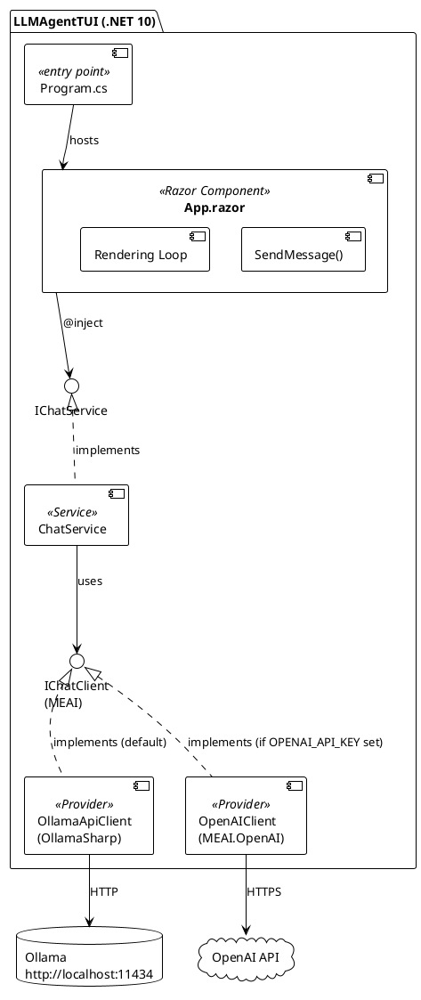
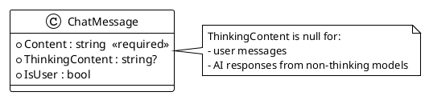
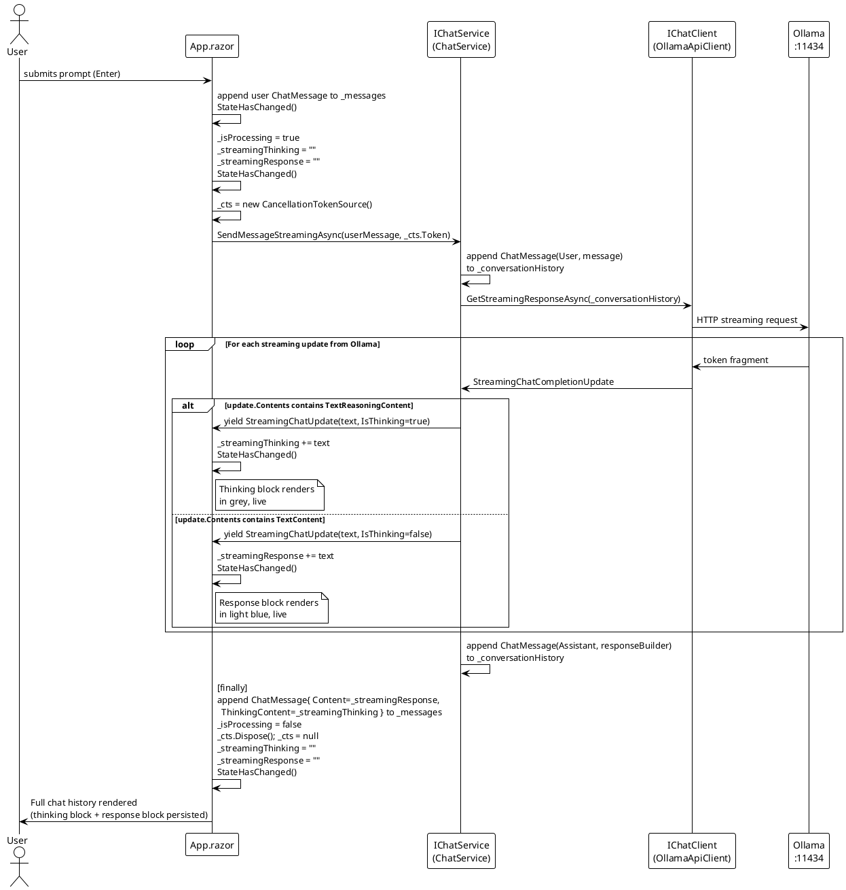

# Show AI Model Thinking — Implementation Documentation

---

## Workflow State

| Field | Value |
|---|---|
| Current Phase | DOCUMENTATION GENERATION PHASE |
| Phase Status | COMPLETE |
| Last Updated | 2026-03-10 |

### Phase History

| Phase | Started | Completed |
|---|---|---|
| DOCUMENTATION PLANNING PHASE | 2026-03-10 | 2026-03-10 |
| DOCUMENTATION GENERATION PHASE | 2026-03-10 | 2026-03-10 |

---

## 1. Overview

### Purpose

This feature extends the `LLMAgentTUI` terminal chat application to surface the **thinking (reasoning) stream** produced by thinking-capable AI models — such as `qwen3.5:9b` running on Ollama — in real time. Prior to this feature, the application used a single blocking API call and discarded thinking tokens silently. Users experienced a silent wait period with no feedback during the model's reasoning phase.

### What Changed

| Capability | Before | After |
|---|---|---|
| Thinking stream visible | No — silently discarded | Yes — streamed in real time, displayed in grey |
| Response delivery | Blocking `CompleteAsync` — full response returned at once | Streaming via `GetStreamingResponseAsync` — token-by-token |
| Response colour | Default terminal colour | Light blue (`Color.LightSkyBlue1`) |
| Thinking persistence | N/A | Always retained and displayed above each bot response |
| Ollama integration | `Microsoft.Extensions.AI.Ollama` v9.x (deprecated, removed) | `OllamaSharp` v5.4.23 + MEAI 10.3.0 |

### Scope

**In scope:**
- Streaming and rendering the thinking/reasoning output from thinking-capable models in real time
- Rendering the final response after the thinking output has completed
- Visual separation between thinking output (grey, italic label) and final response (light blue)
- Graceful handling of non-thinking models — no thinking block rendered when no thinking tokens are received

**Out of scope:**
- Changes to how the user enters prompts
- Changes to model selection or configuration
- Persisting or exporting the thinking output beyond the session
- Backend or API changes beyond what is required to consume the thinking stream

### Reference Documents

| Document | Path |
|---|---|
| Analysis Document | `assets/0001-show-ai-model-thinking/SHOW_AI_MODEL_THINKING_ANALYSIS.md` |
| Implementation Review | `assets/0001-show-ai-model-thinking/SHOW_AI_MODEL_THINKING_REVIEW_20260310_114547.md` |

---

## 2. Architecture

### Application Stack

The application is a single-project, single-layer .NET 10 console application. There are no domain layers, microservices, or data layers. The architecture is flat and direct.

**PlantUML:**



**ASCII Art:**

```
┌──────────────────────────────────────────────────────────┐
│  LLMAgentTUI (.NET 10)                                   │
│                                                          │
│  ┌─────────────┐                                         │
│  │ Program.cs  │──────hosts──────────────────────┐       │
│  └─────────────┘                                 │       │
│                                                  ▼       │
│  ┌───────────────────────────────────────────────────┐   │
│  │  App.razor (Razor Component)                      │   │
│  │  ┌──────────────────┐  ┌──────────────────────┐  │   │
│  │  │  SendMessage()   │  │  Rendering Loop      │  │   │
│  │  └──────────────────┘  └──────────────────────┘  │   │
│  └───────────────────────┬───────────────────────────┘   │
│                          │ @inject                        │
│                          ▼                                │
│              ┌──────────────────────┐                     │
│              │   «interface»        │                     │
│              │   IChatService       │                     │
│              └──────────┬───────────┘                     │
│                         │ implements                      │
│              ┌──────────▼───────────┐                     │
│              │   ChatService        │                     │
│              └──────────┬───────────┘                     │
│                         │ uses                            │
│              ┌──────────▼───────────┐                     │
│              │  «interface»         │                     │
│              │  IChatClient (MEAI)  │                     │
│              └──────┬──────┬────────┘                     │
│                     │      │                              │
│            ┌────────▼──┐ ┌─▼────────────┐                │
│            │OllamaApi  │ │ OpenAIClient │                │
│            │Client     │ │ (if API key) │                │
│            └────────┬──┘ └─▼────────────┘                │
└─────────────────────┼─────┼──────────────────────────────┘
                      │     │
              ┌───────▼──┐ ┌▼──────────┐
              │  Ollama  │ │ OpenAI    │
              │:11434    │ │ API       │
              └──────────┘ └───────────┘
```

### Provider Selection

Provider selection is determined at startup in `Program.cs` via environment variable:

```csharp
var useOllama = string.IsNullOrEmpty(Environment.GetEnvironmentVariable("OPENAI_API_KEY"));
```

- **Default (no key set):** `OllamaApiClient` → Ollama at `http://localhost:11434`, model `qwen3.5:9b`
- **With `OPENAI_API_KEY`:** `OpenAIClient` → `gpt-4o-mini`

> **Note:** The thinking stream feature is only active when using a thinking-capable model (e.g. `qwen3.5:9b`). When using a non-thinking model, no thinking tokens are produced, `ThinkingContent` remains `null`, and the thinking block is not rendered.

---

## 3. Service Contract — `IChatService`

### Business Capability

`IChatService` is the sole service boundary in the application. It abstracts the AI model communication layer from the UI component (`App.razor`). The contract exposes a single streaming operation that delivers both thinking tokens and final response tokens as a unified, discriminated stream.

**PlantUML:**

```plantuml
@startuml
!theme plain

interface IChatService {
  + SendMessageStreamingAsync(message: string, cancellationToken: CancellationToken) : IAsyncEnumerable<StreamingChatUpdate>
}

class ChatService implements IChatService {
  - _chatClient : IChatClient
  - _conversationHistory : List<ChatMessage>
  + SendMessageStreamingAsync(message: string, cancellationToken: CancellationToken) : IAsyncEnumerable<StreamingChatUpdate>
}

class "App.razor" as App
App --> IChatService : @inject

record StreamingChatUpdate {
  + Text : string
  + IsThinking : bool
}

IChatService ..> StreamingChatUpdate : yields

@enduml
```

**ASCII Art:**

```
┌──────────────────────────────────────────────────────┐
│  «interface»  IChatService                           │
│ ──────────────────────────────────────────────────── │
│  + SendMessageStreamingAsync(                        │
│      message: string,                                │
│      cancellationToken: CancellationToken            │
│    ) : IAsyncEnumerable<StreamingChatUpdate>         │
└──────────────────────────┬───────────────────────────┘
                           │ implements
            ┌──────────────▼───────────────────┐
            │  ChatService                      │
            │ ────────────────────────────────  │
            │  - _chatClient: IChatClient       │
            │  - _conversationHistory: List<..> │
            └───────────────────────────────────┘

   App.razor ──@inject──▶ IChatService
                                │
                                │ yields
                                ▼
                    ┌───────────────────────┐
                    │  «record»             │
                    │  StreamingChatUpdate  │
                    │ ──────────────────── │
                    │  Text      : string  │
                    │  IsThinking: bool    │
                    └───────────────────────┘
```

### Contract Operation — `SendMessageStreamingAsync`

**Signature:**

```csharp
IAsyncEnumerable<StreamingChatUpdate> SendMessageStreamingAsync(
    string message,
    CancellationToken cancellationToken = default);
```

**Purpose:** Appends the user message to the conversation history, streams the AI model response, and yields discriminated token fragments as they arrive — each tagged as either a thinking token (`IsThinking = true`) or a final response token (`IsThinking = false`).

**Preconditions:**
- `message` must not be null or empty
- The underlying `IChatClient` must be reachable (Ollama running, or OpenAI API key valid)

**Postconditions:**
- The final assembled response (response tokens only) is appended to the internal `_conversationHistory` as `ChatRole.Assistant`
- The user message is appended to `_conversationHistory` as `ChatRole.User` before streaming begins
- Thinking content is NOT stored in conversation history (only the final response is)

**Behavioral Guarantees:**
- **Streaming:** Yields token fragments incrementally as the model generates them — no buffering of the full response before yielding
- **Discrimination:** Each yielded `StreamingChatUpdate` is unambiguously tagged: `IsThinking = true` for reasoning tokens, `IsThinking = false` for response tokens
- **Graceful non-thinking models:** If the model produces no thinking tokens, only `IsThinking = false` updates are yielded — the consumer handles this transparently
- **Cancellable:** Respects the provided `CancellationToken` via `[EnumeratorCancellation]` — streaming terminates cleanly on cancellation
- **History integrity:** Even if streaming is cancelled mid-response, the history append uses whatever response was accumulated in `responseBuilder` at the time the loop exits

**Exceptions:**
- Any `HttpRequestException` or provider-level exception propagates to the caller (`App.razor`'s `catch` block)
- `OperationCanceledException` propagates on cancellation

### Contract Versioning

This interface replaced the previous synchronous `Task<string> SendMessageAsync(string message)` contract as part of this feature. The old contract is fully removed — there is no backward compatibility layer.

| Version | Method | Notes |
|---|---|---|
| v1 (pre-feature) | `Task<string> SendMessageAsync(string)` | Blocking; returns fully assembled response string |
| v2 (this feature) | `IAsyncEnumerable<StreamingChatUpdate> SendMessageStreamingAsync(string, CancellationToken)` | Streaming; discriminated thinking/response tokens |

---

## 4. Component API — `StreamingChatUpdate`

### Purpose

`StreamingChatUpdate` is the discriminated token fragment type yielded by `IChatService.SendMessageStreamingAsync`. It is the boundary type between the service layer and the UI layer. A single record type carries both thinking and response tokens — the `IsThinking` flag routes each fragment to the correct buffer in the consumer.

**File:** `src/LLMAgentTUI./Services/StreamingChatUpdate.cs`

```csharp
// Copyright (c) RazorConsole. All rights reserved.

namespace LLMAgentTUI.Services;

public record StreamingChatUpdate(string Text, bool IsThinking);
```

### Properties

| Property | Type | Description |
|---|---|---|
| `Text` | `string` | The token fragment text yielded by the model for this update |
| `IsThinking` | `bool` | `true` = this fragment is reasoning/thinking content; `false` = this fragment is final response content |

### Usage

```csharp
await foreach (var update in ChatService.SendMessageStreamingAsync(userMessage, _cts.Token))
{
    if (update.IsThinking)
        _streamingThinking += update.Text;   // → grey thinking block
    else
        _streamingResponse += update.Text;   // → light blue response block

    StateHasChanged();
}
```

### Design Rationale

Strategy A (`IAsyncEnumerable<StreamingChatUpdate>`) was selected over three alternatives:

| Strategy | Verdict | Reason |
|---|---|---|
| A: `IAsyncEnumerable<StreamingChatUpdate>` | ✅ Selected | Idiomatic .NET async streaming; `await foreach` in consumer; cancellable; clean contract |
| B: Callback delegates `(Action<string> onThinking, Action<string> onResponse)` | ❌ | Bleeds UI concerns into service contract; harder to cancel |
| C: `Task<(string Thinking, string Response)>` | ❌ | Batch result — violates real-time thinking progress requirement |
| D: Struct with two separate `IAsyncEnumerable`s | ❌ | No framework support for coordinated dual enumeration; overengineered |

---

## 5. Data Model — `ChatMessage` UI Model

`ChatMessage` is an inner class defined inside `App.razor`'s `@code` block. It is the UI-layer representation of a conversation turn — distinct from `Microsoft.Extensions.AI.ChatMessage` used at the service layer.

**PlantUML:**



**ASCII Art:**

```
┌──────────────────────────────────────────┐
│  ChatMessage (inner class, App.razor)    │
│ ──────────────────────────────────────── │
│  + Content        : string  [required]   │
│  + ThinkingContent: string? [nullable]   │
│  + IsUser         : bool                 │
└──────────────────────────────────────────┘

ThinkingContent is null when:
  • IsUser = true  (user messages have no thinking)
  • AI response from a non-thinking model
```

### Properties

| Property | Type | Nullable | Description |
|---|---|---|---|
| `Content` | `string` | No (`required`) | The final response text from the AI, or the user's message text |
| `ThinkingContent` | `string?` | Yes | The accumulated thinking/reasoning text. `null` for user messages and AI responses from non-thinking models |
| `IsUser` | `bool` | — | `true` = user message; `false` = AI (bot) message |

### Evolution

This feature added `ThinkingContent` to the existing model. The original model had only `Content` and `IsUser`.

```csharp
// Before
public class ChatMessage
{
    public required string Content { get; set; }
    public bool IsUser { get; set; }
}

// After
public class ChatMessage
{
    public required string Content { get; set; }
    public string? ThinkingContent { get; set; }   // ← added
    public bool IsUser { get; set; }
}
```

### Conversation History vs. UI Model

The application maintains two parallel conversation representations:

| | Type | Owner | Content | Purpose |
|---|---|---|---|---|
| UI model | `List<ChatMessage>` | `App.razor` | Content + ThinkingContent | Rendering the chat history in the TUI |
| Service history | `List<Microsoft.Extensions.AI.ChatMessage>` | `ChatService` | Response only (no thinking) | Sending conversation context to the AI model |

Thinking content is stored in the UI model for display but is **excluded from the service-layer history** — thinking tokens are not re-sent to the model as prior context.

---

## 6. Streaming Flow

This sequence diagram shows the complete end-to-end flow from user prompt submission through to the final rendered state.

**PlantUML:**



**ASCII Art:**

```
User          App.razor          ChatService        OllamaApiClient       Ollama
 │                │                   │                   │                  │
 │──submit──────▶│                   │                   │                  │
 │               │ append user msg   │                   │                  │
 │               │ _isProcessing=true│                   │                  │
 │               │ StateHasChanged() │                   │                  │
 │               │                   │                   │                  │
 │               │──SendMessageStream─▶                  │                  │
 │               │                   │──GetStreaming────▶│                  │
 │               │                   │                   │──HTTP stream────▶│
 │               │                   │                   │                  │
 │               │    ┌──────── streaming loop ────────────────────────┐    │
 │               │    │              │◀──StreamingUpdate───────────────│    │
 │               │    │    thinking token? ──TextReasoningContent       │    │
 │               │◀───│──yield(text, IsThinking=true)                  │    │
 │               │    │ _streamingThinking+=text                        │    │
 │               │    │ StateHasChanged() ← grey block renders live    │    │
 │               │    │              │                                  │    │
 │               │    │    response token? ──TextContent                │    │
 │               │◀───│──yield(text, IsThinking=false)                 │    │
 │               │    │ _streamingResponse+=text                        │    │
 │               │    │ StateHasChanged() ← blue block renders live    │    │
 │               │    └────────────────────────────────────────────────┘    │
 │               │                   │                   │                  │
 │               │  [finally]        │                   │                  │
 │               │  append ChatMessage{Content, ThinkingContent}            │
 │               │  _isProcessing=false                 │                  │
 │               │  StateHasChanged()                   │                  │
 │               │                   │                   │                  │
 │◀─ full render─│                   │                   │                  │
```

---

## 7. Rendering Logic

### Streaming State Fields

`App.razor` introduces three new component-level fields to manage in-progress streaming:

```csharp
private CancellationTokenSource? _cts;
private string _streamingThinking = string.Empty;
private string _streamingResponse = string.Empty;
```

These fields accumulate streaming content during an in-progress request. They are cleared in the `finally` block after the final `ChatMessage` is appended to `_messages`.

### Rendering Loop Structure

The template renders two distinct categories of content:

**1. Completed messages** (`_messages` list — rendered from history):

```razor
foreach (var message in _messages)
{
    @if (message.IsUser)
    {
        <Padder>
            <Markup "You" Green />
            <Markup " " />
            <Markdown @message.Content />
        </Padder>
    }
    else
    {
        @if (!string.IsNullOrEmpty(message.ThinkingContent))
        {
            <Padder>
                <Markup "Thinking" Grey Italic />      ← thinking label
                <Markup @message.ThinkingContent Grey />
            </Padder>
        }
        <Padder>
            <Markup "Bot" Blue />                      ← response
            <Markup " " />
            <Markup @message.Content LightSkyBlue1 />
        </Padder>
    }
}
```

**2. Live streaming blocks** (rendered only while `_isProcessing = true`):

```razor
@if (_isProcessing && !string.IsNullOrEmpty(_streamingThinking))
{
    <Padder>
        <Markup "Thinking" Grey Italic />
        <Markup @_streamingThinking Grey />
    </Padder>
}

@if (_isProcessing && !string.IsNullOrEmpty(_streamingResponse))
{
    <Padder>
        <Markup "Bot" Blue />
        <Markup " " />
        <Markup @_streamingResponse LightSkyBlue1 />
    </Padder>
}
```

### RazorConsole Constraints Discovered

Two RazorConsole-specific rendering constraints were discovered during implementation and influence the architecture of the rendering loop:

**Constraint 1 — `<Padder>` requires a fixed child count**

Placing `@if` blocks or `foreach` loops directly inside `<Padder>` causes the component to fail to render any children. All conditional content must be placed at the `<Rows>` level. Each `<Padder>` must always receive the same fixed set of children.

*Consequence:* Each conditional block (thinking / response) is its own separate `<Padder>`, rather than being nested inside a single outer `<Padder>`.

**Constraint 2 — Re-render triggers on list append only, not on item mutation**

Mutating a `_messages[index]` item's properties during streaming does not trigger a re-render. Only appending a new item to `_messages` causes the list to re-render.

*Consequence:* Streaming content is accumulated in the component-level fields `_streamingThinking` / `_streamingResponse` (which are re-read on every `StateHasChanged()` call). The final `ChatMessage` is appended to `_messages` only once, after streaming completes.

---

## 8. Dependencies

### Package Changes

| Package | Before | After | Reason |
|---|---|---|---|
| `Microsoft.Extensions.AI` | `9.1.0-preview.1.25064.3` | `10.3.0` | API rename: `CompleteStreamingAsync` → `GetStreamingResponseAsync` |
| `Microsoft.Extensions.AI.Ollama` | `9.1.0-preview.1.25064.3` | **Removed** | Package deprecated and removed from NuGet entirely |
| `Microsoft.Extensions.AI.OpenAI` | `9.1.0-preview.1.25064.3` | `10.3.0` | API change: `AsChatClient()` → `AsIChatClient()` on `ChatClient` |
| `OllamaSharp` | — | `5.4.23` | Replacement for `Microsoft.Extensions.AI.Ollama`; correctly surfaces thinking via `TextReasoningContent` |
| `Microsoft.Extensions.Hosting` | `8.0.0` | `8.0.0` | Unchanged |
| `RazorConsole.Core` | `0.3.0` | `0.3.0` | Unchanged |
| `Spectre.Console` | `0.54.0` | `0.54.0` | Unchanged |

### Why OllamaSharp?

The original plan called for `Microsoft.Extensions.AI.Ollama` (MEAI's own Ollama provider) with a `<think>` tag state machine in `ChatService`. Investigation via ILSpy during analysis confirmed that `OllamaChatClient` in v9.x surfaces all content — including thinking — as `TextContent`, with `<think>` and `</think>` tags as literal characters in the text stream. A state machine was planned to parse these tags.

When implementation began, the package had been removed from NuGet entirely. The root cause: newer Ollama (0.6.5+) changed its API to send thinking content in a dedicated `thinking` field rather than inline in the `content` field. MEAI v9.x's `OllamaChatClient` did not know about this field and silently discarded it.

`OllamaSharp` v5.4.23 is the current community-standard Ollama integration for MEAI. It correctly maps the Ollama `thinking` field to `TextReasoningContent` in MEAI's `update.Contents`. This eliminated the need for the planned tag-parsing state machine entirely.

### `TextReasoningContent` vs. `<think>` Tag Parsing

| Aspect | Planned: Tag parsing | Actual: `TextReasoningContent` |
|---|---|---|
| Approach | State machine scanning for `<think>` / `</think>` in raw text stream | Pattern match `content is TextReasoningContent` in `update.Contents` |
| Complexity | High — must handle partial tag boundaries mid-fragment | Low — provider handles discrimination natively |
| Robustness | Fragile — depends on tag format staying constant | Robust — relies on provider's native type system |
| Code | ~30 lines of state machine logic | 2 lines of pattern matching |

---

## 9. Implementation Decisions

Four deviations from the approved Implementation Plan were required during implementation. All four were approved by the Architect.

### Deviation 1 — RazorConsole `<Padder>` child count constraint

**Planned:** Conditional `@if` block inside a single outer `<Padder>` for the thinking block.
**Actual:** `<Padder>` does not support dynamic child counts. Two separate `<Padder>` instances are used — one conditional (thinking), one always-present (response) — both at `<Rows>` level.
**Impact:** Rendering loop restructured; conditional content moved to `<Rows>` scope.

### Deviation 2 — RazorConsole append-only re-render model

**Planned:** Pre-add an empty `ChatMessage` to `_messages`, capture its index, and mutate `Content`/`ThinkingContent` incrementally inside the streaming loop.
**Actual:** RazorConsole only re-renders when items are appended to a list, not when existing items are mutated. Live streaming content is accumulated in component-level fields (`_streamingThinking`, `_streamingResponse`); the final `ChatMessage` is appended once after streaming completes.
**Impact:** Separate `_streamingThinking` / `_streamingResponse` fields added; final append happens in `finally` block.

### Deviation 3 — OllamaSharp migration + MEAI 10.x API rename

**Planned:** `Microsoft.Extensions.AI.Ollama` v9.x + `<think>` tag state machine in `ChatService`.
**Actual:** Package removed from NuGet. OllamaSharp v5.4.23 added; MEAI upgraded to 10.x. Thinking surfaces as `TextReasoningContent` — no tag parsing needed.
**Impact:** Simpler `ChatService` implementation; `GetStreamingResponseAsync` replaces `CompleteStreamingAsync`.

### Deviation 4 — Response colour via `<Markup>` not `<Markdown>`

**Planned:** `<Markdown Content="@message.Content" />` for bot response rendering (which would apply Markdown formatting).
**Actual:** `<Markdown>` in RazorConsole has no `Foreground` parameter. Applying `Color.LightSkyBlue1` requires using `<Markup>`, which does not render Markdown formatting but correctly colours the text. The Architect manually applied this change.
**Impact:** Bot responses do not render Markdown formatting (bold, code blocks, etc.); they render as plain coloured text.

---

## 10. Known Limitations

### Error message styling regression

When the AI model call throws an exception, the error is stored in `_streamingResponse` as a plain string (`$"Error: {ex.Message}"`) and rendered with the same light blue colour as a normal bot response. The original implementation used Spectre red markup (`[red]Error: ...[/]`), making errors visually distinct. This regression was identified in the Implementation Review (MEDIUM severity).

### No concurrent-call guard

`SendMessage()` does not guard against being called while `_isProcessing` is `true`. A rapid double-submit could result in two concurrent streaming operations writing to the same `_streamingThinking` / `_streamingResponse` fields. This is a pre-existing omission (not introduced by this feature) and is unlikely in a TUI context.

### Response text does not render Markdown

Bot responses are rendered via `<Markup>` (for colour support) rather than `<Markdown>`. Markdown formatting in responses — such as bold, italic, code blocks, or bullet lists — is displayed as raw Markdown syntax characters rather than rendered formatting.

### Thinking content not included in conversation history

Thinking tokens are accumulated for display but are not stored in the service-layer `_conversationHistory`. The model does not receive its own prior thinking as context. This is consistent with typical extended reasoning model behaviour, but means follow-up prompts cannot reference the thinking content.

---

## 11. References

| Document | Description |
|---|---|
| `assets/0001-show-ai-model-thinking/SHOW_AI_MODEL_THINKING_ANALYSIS.md` | Full analysis document: feature analysis, deep code analysis, ADRs, implementation plan, deviations, and learnings |
| `assets/0001-show-ai-model-thinking/SHOW_AI_MODEL_THINKING_REVIEW_20260310_114547.md` | Implementation Review Report: findings, compliance assessment, and approval status |
| `src/LLMAgentTUI./Services/IChatService.cs` | Service contract interface |
| `src/LLMAgentTUI./Services/ChatService.cs` | Service contract implementation |
| `src/LLMAgentTUI./Services/StreamingChatUpdate.cs` | Discriminated token fragment record |
| `src/LLMAgentTUI./Components/App.razor` | UI component — rendering loop and streaming state |
| `src/LLMAgentTUI./Program.cs` | Host configuration and provider registration |
| `src/LLMAgentTUI./LLMAgentTUI.csproj` | Project file — package references |

---

## Prompt Log

| # | Date & Time | Phase | Prompt |
|---|-------------|-------|--------|
| 1 | 2026-03-10 11:54 | DOCUMENTATION PLANNING PHASE | Show AI model thinking, /Users/peter/Projects/cucurb-it/analysis-gated-workflow-demo/assets/0001-show-ai-model-thinking |
| 2 | 2026-03-10 11:54 | DOCUMENTATION PLANNING PHASE | The audiences are SOFTWARE ARCHITECTS and DEVELOPERS, add PlantUML diagrams and the ANALYSIS document is the backdrop for this documentation. |
| 3 | 2026-03-10 11:54 | DOCUMENTATION PLANNING PHASE | proceed |
| 4 | 2026-03-10 11:58 | DOCUMENTATION GENERATION PHASE | finalize the documentation |