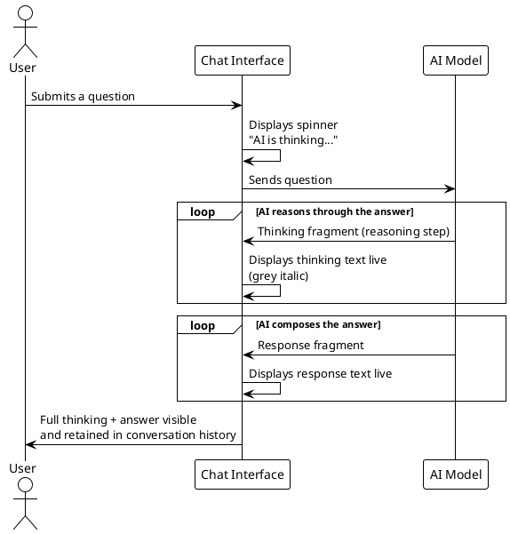

# Show AI Model Thinking — Business Stakeholder Documentation

---

## Workflow State

| Field | Value |
|---|---|
| Current Phase | DOCUMENTATION GENERATION PHASE |
| Phase Status | COMPLETE |
| Last Updated | 2026-03-13 |

### Phase History

| Phase | Started | Completed |
|---|---|---|
| DOCUMENTATION PLANNING PHASE | 2026-03-13 | 2026-03-13 |
| DOCUMENTATION GENERATION PHASE | 2026-03-13 | 2026-03-13 |

---

## Summary

- This feature makes AI reasoning visible to users in real time — before the final answer appears — turning a silent wait into a live, transparent experience.
- Users no longer wonder whether the AI is working; they watch it think.
- The change establishes a foundation for future AI transparency capabilities across the product.

---

## 1. Executive Summary

The **Show AI Model Thinking** feature surfaces the AI's reasoning process to users in real time. When a user submits a question, they now see the AI's internal reasoning — its "thinking" — appear on screen as it happens, followed by the final answer. Previously, users submitted a question and waited in silence for an unknown period of time before a response appeared. This feature eliminates that silent wait, builds user trust through transparency, and positions the product to lead on AI explainability.

---

## 2. The Business Problem

Before this feature, the user experience during AI processing looked like this:

> *User submits a question. Nothing happens. After several seconds — sometimes longer for complex questions — a response appears.*

This created three concrete business problems:

| Problem | Impact |
|---|---|
| **No feedback during processing** | Users could not tell if the application was working, frozen, or slow. Perceived reliability suffered. |
| **AI as a black box** | Users received answers with no insight into how the AI arrived at them. This erodes trust, especially for complex or nuanced questions. |
| **Poor experience with thinking-capable models** | Modern AI models perform multi-step reasoning before answering. Without surfacing this, the product was not utilising the full value of these models. |

---

## 3. What Changed: Before vs. After

| | Before | After |
|---|---|---|
| **What users see when waiting** | A blank screen — no indication the AI is active | The AI's reasoning appears live, line by line, in real time |
| **Visual style of thinking** | N/A | Grey italic text — visually distinct from the final answer |
| **Final answer delivery** | Full response appears all at once after a silent wait | Response streams in token by token, immediately after thinking completes |
| **User understanding of AI behaviour** | None — the AI's process was invisible | Users see *how* the AI is approaching the question before it answers |
| **Thinking preserved in history** | N/A | Thinking is retained above each response in the conversation history |

---

## 4. User Experience Flow

How a conversation turn works after this feature is delivered.

**PlantUML:**



**ASCII Art:**

```
     User             Chat Interface              AI Model
      │                     │                        │
      │──submits question──▶│                        │
      │                     │──────sends question───▶│
      │                     │                        │
      │                     │   ┌─ AI reasons ──────┐│
      │                     │◀──│ thinking fragment  ││
      │  grey italic text   │   │ thinking fragment  ││
      │  appears live  ◀────│   │ ...                ││
      │                     │   └────────────────────┘│
      │                     │                        │
      │                     │   ┌─ AI answers ──────┐│
      │                     │◀──│ response fragment  ││
      │  response streams   │   │ response fragment  ││
      │  in live       ◀────│   │ ...                ││
      │                     │   └────────────────────┘│
      │                     │                        │
      │◀────────────────────│                        │
      │  full thinking +    │                        │
      │  answer retained    │                        │
      │  in history         │                        │
```

---

## 5. Business Value

### Transparency Builds Trust

Users can follow the AI's reasoning before the answer arrives. For complex questions — where the answer may be surprising or nuanced — seeing the reasoning path gives users the context to evaluate and trust the response.

### Perceived Performance

The application now feels fast from the moment the user submits a question. Displaying live reasoning output means users are engaged immediately, even if the final answer takes several seconds to generate. Perceived wait time drops significantly.

### Competitive Positioning

AI transparency is an emerging differentiator. Products that surface reasoning — rather than treating AI as a black box — are better positioned as enterprise and professional buyers increasingly scrutinise AI decision-making. This feature is a foundation for that story.

### Foundation for Future Capabilities

The streaming architecture introduced by this feature enables future work without further architectural change:

- Showing reasoning confidence or uncertainty indicators
- Allowing users to interrupt or redirect the AI mid-thought
- Logging or auditing AI reasoning for compliance purposes

---

## 6. Known Limitations

Three limitations are worth noting for stakeholders at this time:

**1. Thinking output is session-only**
The AI's reasoning is displayed during the conversation but cannot be saved, exported, or shared. If a user closes the application, the thinking output is not retained anywhere.

**2. Responses display as plain text**
AI responses are rendered as plain text. Formatting such as bullet lists, bold text, and code blocks appear as raw characters rather than formatted output. This is a known constraint of the current interface component and is tracked for future resolution.

**3. Error messages are not visually distinct**
If the AI encounters an error, the error message is currently displayed in the same visual style as a normal response. Users may not immediately recognise an error has occurred. This is tracked for a future fix.

---

## 7. Further Reading

| Document | Audience | Description |
|---|---|---|
| [Developer Documentation](./SHOW_AI_MODEL_THINKING_DOCUMENTATION_FOR_DEVELOPERS.md) | Engineers | Full technical documentation: architecture, service contracts, component APIs, implementation decisions, deviations, and dependencies |

---

## Prompt Log

| # | Date & Time | Phase | Prompt |
|---|-------------|-------|--------|
| 1 | 2026-03-13 | DOCUMENTATION PLANNING PHASE | Show AI model thinking, /Users/peter/Projects/cucurb-it/analysis-gated-workflow-demo/assets/0001-show-ai-model-thinking — new documentation file for non-technical business stakeholders |
| 2 | 2026-03-13 | DOCUMENTATION PLANNING PHASE | Feature framing: "A new capability that shows users what the AI is thinking before it answers". Include: business problem, before/after UX, business value/ROI. Exclude: code and technical details. Diagrams: PlantUML sequence + ASCII. Tone: concise summary. |
| 3 | 2026-03-13 | DOCUMENTATION PLANNING PHASE | Add a link to the technical documentation for DEVELOPERS. |
| 4 | 2026-03-13 | DOCUMENTATION PLANNING PHASE | Generate documentation. |
| 5 | 2026-03-13 | DOCUMENTATION GENERATION PHASE | Finalize — Architect approved. |